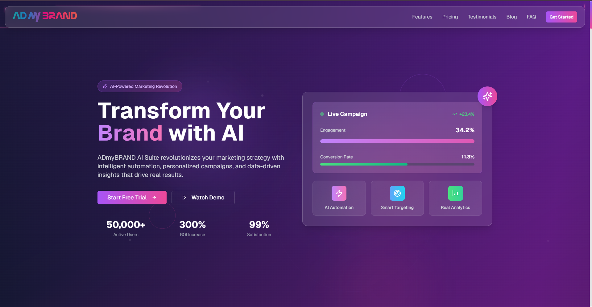

# 🚀 ADmyBRAND AI Suite – AI-Powered Marketing Landing Page

A modern, responsive landing page for the fictional AI-powered marketing tool **ADmyBRAND AI Suite**. Built using **Next.js 14+**, **TypeScript**, and **Tailwind CSS**, the page follows 2025 design trends like glassmorphism, scroll-based animations, and mobile-first UX.

---

## 🔗 Live Demo

🌐 [View Live Demo](https://admybrand-landing-roan.vercel.app/)

---

## 📸 Preview

 <!-- Replace with actual image path or delete this line -->

---

## 🛠 Tech Stack

- ⚛️ Next.js 14+ (App Router)
- 🧠 TypeScript
- 💨 Tailwind CSS
- 🎥 Framer Motion (for animations)
- 💻 Vercel (for deployment)

---

## 📦 Features

- 🧠 Hero Section with animated CTA and AI branding
- 💡 Features section with icons & descriptions (6+)
- 💰 Interactive Pricing Cards (3 tiers)
- 🙌 Testimonials Carousel with customer reviews
- ❓ Collapsible FAQ Section
- 📬 Contact Form with validation
- 🎨 Glassmorphism, subtle hover animations, modern typography
- 🌙 Dark/Light Mode Toggle (optional/bonus)
- 📱 Fully Mobile-Responsive

---

## 🧩 Component Library

Reusable components include:

- `Button`
- `Card`
- `Modal`
- `Navbar`
- `PricingCard`
- `FAQItem`
- `TestimonialSlide`
- `InputField`

---

## 📂 Getting Started

Clone the repo and run locally:

```bash
git clone https://github.com/your-username/admybrand-landing.git
cd admybrand-landing
npm install
npm run dev
